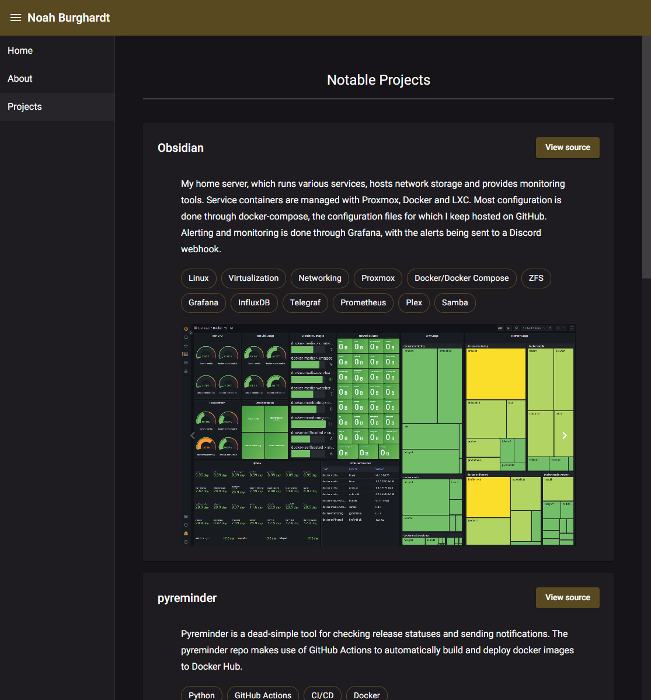

# Website

A full-stack implementation of my personal website, using the following technologies:

* htmx
* hyperscript
* python
* flask
* gitlab ci/cd. viewable on the [upstream gitlab repo](https://gitlab.com/haondt/website)

### Development

To run locally, install the dev dependencies and start the python script.

```shell
python3 -m pip install -r dev-requirements.txt
python3 website/website.py
```

To build and run the docker image locally, run the docker compose file.

```shell
docker compose up
```

# History

I think it's interesting to keep a history of the evolution of this site.

<details>
    <summary>Expand history</summary>

##  v1: HTML + CSS


This version was pure, artisinally-crafted, free-range, handmade html and css, my first website ever. The design language was influenced by Windows 10, and featured sharp corners and bold text, with a black and purple color scheme. Most of the buttons used icons to communicate information rather than text.

## v2: React

This version looked pretty much identical to v1, but it was rebuild in react. Being a SPA, loading different pages was a bit smoother.

## v3: Angular




v3 introduced a new black and gold colorscheme. The "black" is actually a very, very dark purple. Built with Angular Material, the design language in this version draws a lot more inspiration from Google material design. This version also introduced image carousels and modals to view the project page images in detail. v3 had a vertical navigation bar, which was visually nicer than the v1/v2 navigation, but was retrospectively worse UX. Additional the space eaten up by the navigation menu caused all sorts of scaling issues on mobile. This version also preferred text over icons to communicate information on buttons and chips.

## v4: .NET + htmx

v4 was built with the goal of reducing dependencies and fixing the shortcomings of v3. This version uses htmx served by ASP.NET MVC to deliver components, and hyperscript for some light scripting. All the UI components are built from scratch with pure css and SSR Razor pages. Visually, the design is decidedly basic, taking inspiration from GitHub and Markdown. A big issue with v3 was poor mobile support due to the material components breaking down on smaller screens. v4 was built with mobile support in mind from the start.

I think this version does a good job at taking the best parts of all the previous versions, an horizontal navigation bar, buttons with both text and icons, textual chips, mobile support, a simple design and few dependencies. It uses the same colorscheme as v3, but is much more sparing with the accent color. It also makes liberal use of css transitions, making the site feel smooth and fluid.


## v5: python + htmx

In the interest of further shrinking down the codebase for the site, I moved from .NET to python. I kept the same style as v4, but tried to make the site less "annoying" to use. I removed some css animations that made the site seem to stutter a bit or feel less responsive. I also removed the `mailto` link as I don't like the way those links work.

I merged the home and about pages, and anonymized some more of the site. One of my favorite features of this version is finally learning about `color-scheme: dark;`, which lets me use the native scroll bar without it being blindingly white. Previously I had been meticulously restyling each component of the scroll bar.

</details>
